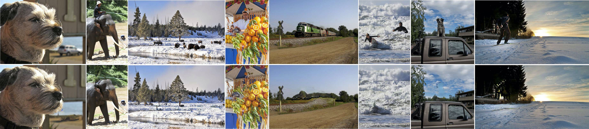

# Context-Aware Occlusion Removal

### Introduction

Occlusion removal is an interesting application of image enhancement, for which, existing work suggests manually-annotated or domain-specific occlusion removal. No work tries to address automatic occlusion detection and removal as a context-aware generic problem. In this paper, we present a novel methodology to identify objects that do not relate to the image context as occlusions and remove them, reconstructing the space occupied coherently. The proposed system detects occlusions by considering the relation between foreground and background object classes represented as vector embeddings, and removes them through inpainting. We test our system on COCO-Stuff dataset and conduct a user study to establish a baseline in context-aware automatic occlusion removal.

In this paper, we propose a novel approach for occlusion removal using an architecture which fuses both image and language processing. First, we process the input image to extract background and foreground object classes separately with pixel-wise annotations of foreground objects. Then, our language model intuitively decides the relation of each foreground object to the image context; hence, it identifies occlusions. Finally, we mask the pixels of occlusions and feed the image into an inpainting model which produces an occlusion-free image. This task separation allows us to tackle the issue of the lack of object-background relationships in datasets, since our system relies on semantic segmentations and image captions for training.

System Architecture


Qualitative Results



### Dependencies

- Python 2.7.14
- Tensorflow >= 1.9.0
- Keras >= 2.2.2
- OpenCV >= 3.4.2
- NumPy
- NeuralGym

### Quick start (Test)

1. Download (from [here](https://drive.google.com/drive/folders/1Ga2iXdwAUygMIsIYQdHT0B6xsG6vDML7?usp=sharing)) and update model checkpoints in [checkpoints](./checkpoints).

2. Run `./run_test.sh`.

### Reference

If you find our work useful, please consider citing our work:
```
@inproceedings{kahatapitiya2019context,
  title={Context-Aware Automatic Occlusion Removal},
  author={Kahatapitiya, Kumara and Tissera, Dumindu and Rodrigo, Ranga},
  booktitle={2019 IEEE International Conference on Image Processing (ICIP)},
  pages={1895--1899},
  year={2019},
  organization={IEEE}
}
```

### Acknowledgements

This work utilizes repositories [deeplab](https://github.com/tensorflow/models/tree/master/research/deeplab), [keras-resnet](https://github.com/raghakot/keras-resnet) and [generative_inpainting](https://github.com/JiahuiYu/generative_inpainting). We thank the original authors for their work.
